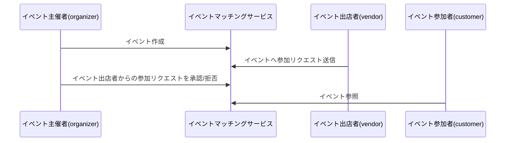
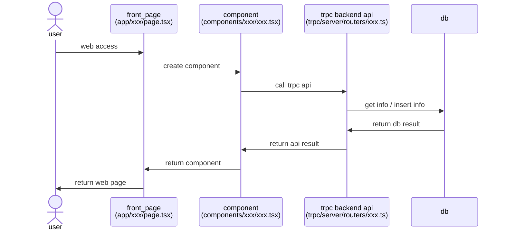

# event-matching-service


## Local Development

### Prepare development

#### Setting Environment variable

```bash
$ npm run apply-local-env
```

https://vercel.com/docs/cli

#### Setting DB

```bash
# start supabase locally
$ supabase start

# db init and insert
$ npm run db-local
```

https://supabase.com/docs/guides/cli/local-development

### Run

```bash
# local run
$ npm run dev
```

see http://localhost:3000

### Test

```bash
$ npm run e2e-test
```

## Technical Stack

### Architecture

<a href="https://create.t3.gg/" target="_blank">T3 Stack</a>

### Frontend & Backend Language

<a href="https://nextjs.org/" target="_blank"></a>
<a href="https://www.typescriptlang.org/" target="_blank"></a>

### Design

<a href="https://tailwindcss.com/" target="_blank"></a>
<a href="https://ui.shadcn.com/" target="_blank"></a>

### Deployment

<a href="https://vercel.com/" target="_blank"></a>

### DB

<a href="https://supabase.com/" target="_blank"></a>

### File Cloud Storage

<a href="https://cloudinary.com/" target="_blank"></a>

### CI/CD

<a href="https://docs.github.com/ja/actions" target="_blank"></a>

### E2E

<a href="https://playwright.dev/" target="_blank"></a>

## System Diagram


## イベントフロー



## System Flow



## ER Diagram

[ER diagram](./ER-diagram.md)

## Branch Stragegy


