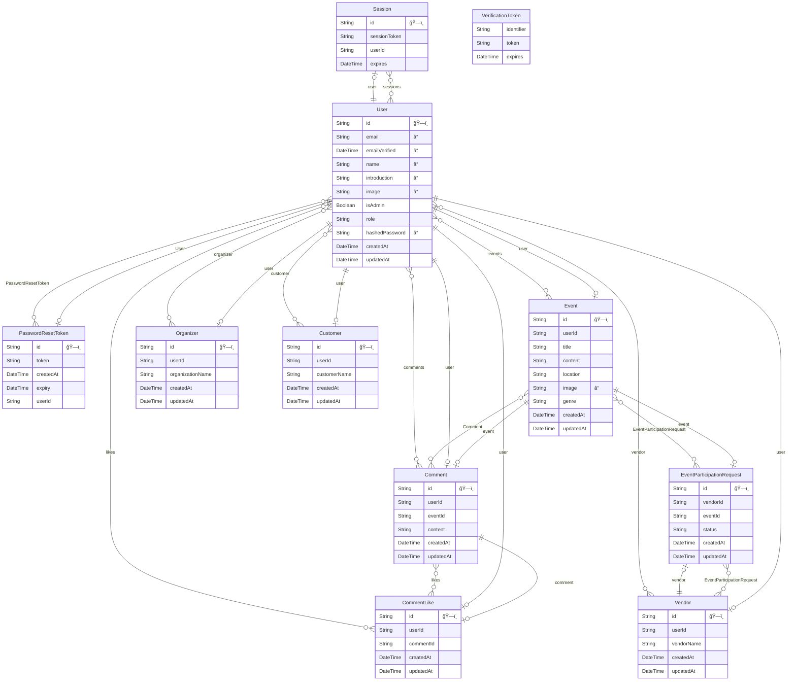

```mermaid
erDiagram

  "Session" {
    String id "ğŸ—ï¸"
    String sessionToken
    String userId
    DateTime expires
    }


  "User" {
    String id "ğŸ—ï¸"
    String email "â“"
    DateTime emailVerified "â“"
    String name "â“"
    String introduction "â“"
    String image "â“"
    Boolean isAdmin
    String role
    String hashedPassword "â“"
    DateTime createdAt
    DateTime updatedAt
    }


  "PasswordResetToken" {
    String id "ğŸ—ï¸"
    String token
    DateTime createdAt
    DateTime expiry
    String userId
    }


  "VerificationToken" {
    String identifier
    String token
    DateTime expires
    }


  "Event" {
    String id "ğŸ—ï¸"
    String userId
    String title
    String content
    String location
    String image "â“"
    String genre
    DateTime createdAt
    DateTime updatedAt
    }


  "Comment" {
    String id "ğŸ—ï¸"
    String userId
    String eventId
    String content
    DateTime createdAt
    DateTime updatedAt
    }


  "CommentLike" {
    String id "ğŸ—ï¸"
    String userId
    String commentId
    DateTime createdAt
    DateTime updatedAt
    }


  "Organizer" {
    String id "ğŸ—ï¸"
    String userId
    String organizationName
    DateTime createdAt
    DateTime updatedAt
    }


  "Vendor" {
    String id "ğŸ—ï¸"
    String userId
    String vendorName
    DateTime createdAt
    DateTime updatedAt
    }


  "Customer" {
    String id "ğŸ—ï¸"
    String userId
    String customerName
    DateTime createdAt
    DateTime updatedAt
    }


  "EventParticipationRequest" {
    String id "ğŸ—ï¸"
    String vendorId
    String eventId
    String status
    DateTime createdAt
    DateTime updatedAt
    }

    "Session" o|--|| "User" : "user"
    "User" o{--}o "Session" : "sessions"
    "User" o{--}o "PasswordResetToken" : "PasswordResetToken"
    "User" o{--}o "Event" : "events"
    "User" o{--}o "Comment" : "comments"
    "User" o{--}o "CommentLike" : "likes"
    "User" o{--}o "Organizer" : "organizer"
    "User" o{--}o "Vendor" : "vendor"
    "User" o{--}o "Customer" : "customer"
    "PasswordResetToken" o|--|| "User" : "User"
    "Event" o{--}o "Comment" : "Comment"
    "Event" o{--}o "EventParticipationRequest" : "EventParticipationRequest"
    "Event" o|--|| "User" : "user"
    "Comment" o{--}o "CommentLike" : "likes"
    "Comment" o|--|| "User" : "user"
    "Comment" o|--|| "Event" : "event"
    "CommentLike" o|--|| "User" : "user"
    "CommentLike" o|--|| "Comment" : "comment"
    "Organizer" o|--|| "User" : "user"
    "Vendor" o{--}o "EventParticipationRequest" : "EventParticipationRequest"
    "Vendor" o|--|| "User" : "user"
    "Customer" o|--|| "User" : "user"
    "EventParticipationRequest" o|--|| "Vendor" : "vendor"
    "EventParticipationRequest" o|--|| "Event" : "event"
```
