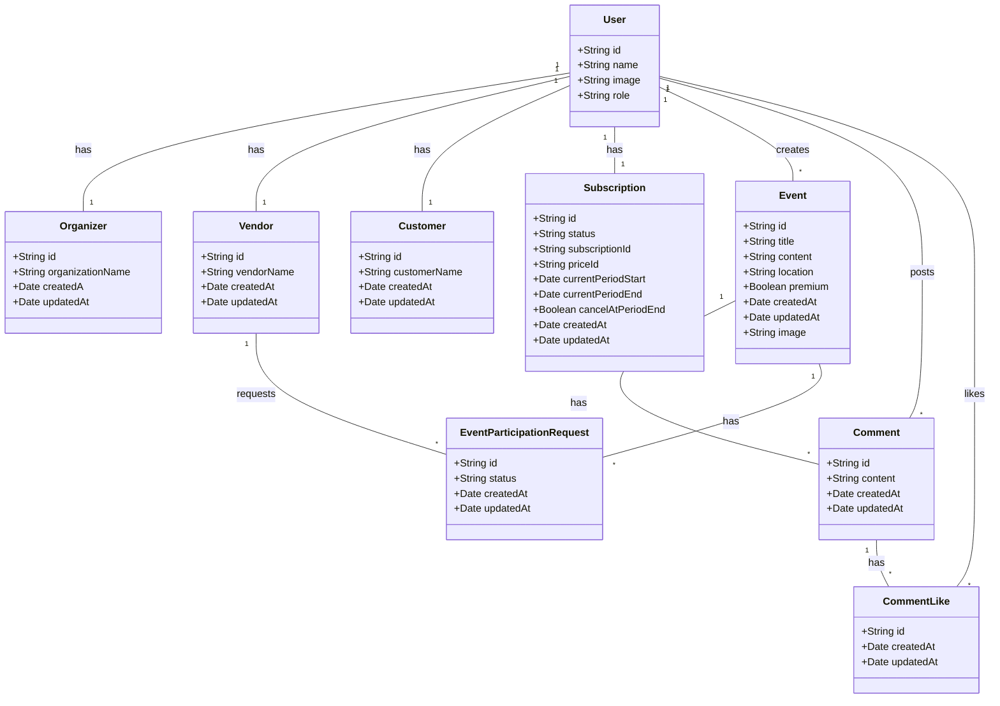

```mermaid
classDiagram
    class User {
        +String id
        +String name
        +String image
        +String role
    }
    class Event {
        +String id
        +String title
        +String content
        +String location
        +Boolean premium
        +Date createdAt
        +Date updatedAt
        +String image
    }
    class Comment {
        +String id
        +String content
        +Date createdAt
        +Date updatedAt
    }
    class CommentLike {
        +String id
        +Date createdAt
        +Date updatedAt
    }
    class EventParticipationRequest {
        +String id
        +String status
        +Date createdAt
        +Date updatedAt
    }
    class Vendor {
        +String id
        +String vendorName
        +Date createdAt
        +Date updatedAt
    }
    class Organizer {
        +String id
        +String organizationName
        +Date createdA
        +Date updatedAt
    }
    class Customer {
        +String id
        +String customerName
        +Date createdAt
        +Date updatedAt
    }
    class Subscription {
        +String id
        +String status
        +String subscriptionId
        +String priceId
        +Date currentPeriodStart
        +Date currentPeriodEnd
        +Boolean cancelAtPeriodEnd
        +Date createdAt
        +Date updatedAt
    }

    User "1" -- "1" Organizer : has
    User "1" -- "1" Vendor : has
    User "1" -- "1" Customer : has
    User "1" -- "1" Subscription : has
    User "1" -- "*" Event : creates
    User "1" -- "*" Comment : posts
    User "1" -- "*" CommentLike : likes
    Event "1" -- "*" Comment : has
    Comment "1" -- "*" CommentLike : has
    Event "1" -- "*" EventParticipationRequest : has
    Vendor "1" -- "*" EventParticipationRequest : requests
```