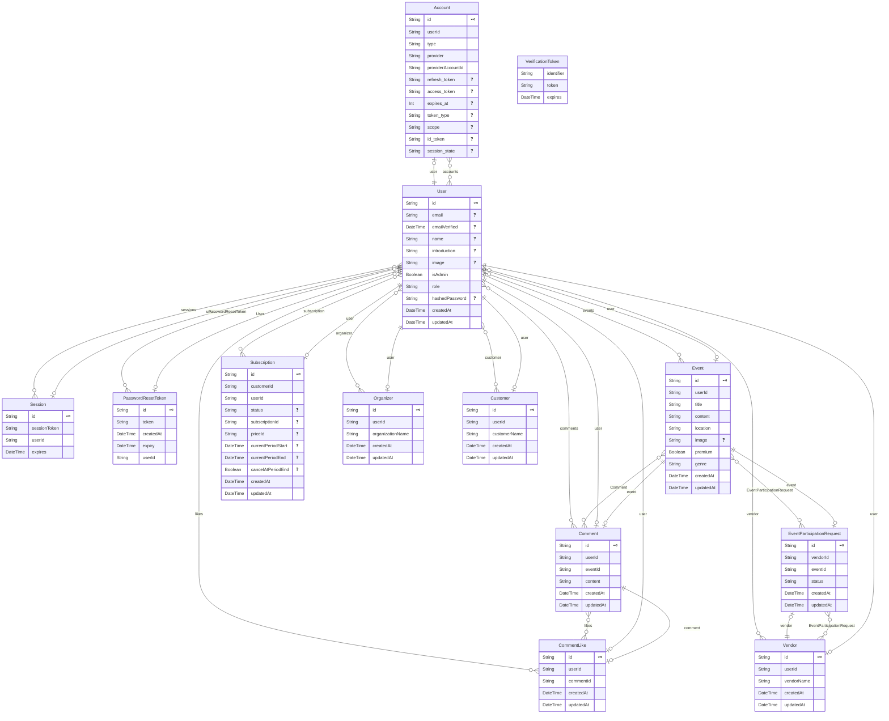

```mermaid
erDiagram

  "Account" {
    String id "🗝️"
    String userId 
    String type 
    String provider 
    String providerAccountId 
    String refresh_token "❓"
    String access_token "❓"
    Int expires_at "❓"
    String token_type "❓"
    String scope "❓"
    String id_token "❓"
    String session_state "❓"
    }
  

  "Session" {
    String id "🗝️"
    String sessionToken 
    String userId 
    DateTime expires 
    }
  

  "User" {
    String id "🗝️"
    String email "❓"
    DateTime emailVerified "❓"
    String name "❓"
    String introduction "❓"
    String image "❓"
    Boolean isAdmin 
    String role 
    String hashedPassword "❓"
    DateTime createdAt 
    DateTime updatedAt 
    }
  

  "PasswordResetToken" {
    String id "🗝️"
    String token 
    DateTime createdAt 
    DateTime expiry 
    String userId 
    }
  

  "VerificationToken" {
    String identifier 
    String token 
    DateTime expires 
    }
  

  "Event" {
    String id "🗝️"
    String userId 
    String title 
    String content 
    String location 
    String image "❓"
    Boolean premium 
    String genre 
    DateTime createdAt 
    DateTime updatedAt 
    }
  

  "Comment" {
    String id "🗝️"
    String userId 
    String eventId 
    String content 
    DateTime createdAt 
    DateTime updatedAt 
    }
  

  "CommentLike" {
    String id "🗝️"
    String userId 
    String commentId 
    DateTime createdAt 
    DateTime updatedAt 
    }
  

  "Subscription" {
    String id "🗝️"
    String customerId 
    String userId 
    String status "❓"
    String subscriptionId "❓"
    String priceId "❓"
    DateTime currentPeriodStart "❓"
    DateTime currentPeriodEnd "❓"
    Boolean cancelAtPeriodEnd "❓"
    DateTime createdAt 
    DateTime updatedAt 
    }
  

  "Organizer" {
    String id "🗝️"
    String userId 
    String organizationName 
    DateTime createdAt 
    DateTime updatedAt 
    }
  

  "Vendor" {
    String id "🗝️"
    String userId 
    String vendorName 
    DateTime createdAt 
    DateTime updatedAt 
    }
  

  "Customer" {
    String id "🗝️"
    String userId 
    String customerName 
    DateTime createdAt 
    DateTime updatedAt 
    }
  

  "EventParticipationRequest" {
    String id "🗝️"
    String vendorId 
    String eventId 
    String status 
    DateTime createdAt 
    DateTime updatedAt 
    }
  
    "Account" o|--|| "User" : "user"
    "Session" o|--|| "User" : "user"
    "User" o{--}o "Account" : "accounts"
    "User" o{--}o "Session" : "sessions"
    "User" o{--}o "PasswordResetToken" : "PasswordResetToken"
    "User" o{--}o "Event" : "events"
    "User" o{--}o "Comment" : "comments"
    "User" o{--}o "CommentLike" : "likes"
    "User" o{--}o "Subscription" : "subscription"
    "User" o{--}o "Organizer" : "organizer"
    "User" o{--}o "Vendor" : "vendor"
    "User" o{--}o "Customer" : "customer"
    "PasswordResetToken" o|--|| "User" : "User"
    "Event" o{--}o "Comment" : "Comment"
    "Event" o{--}o "EventParticipationRequest" : "EventParticipationRequest"
    "Event" o|--|| "User" : "user"
    "Comment" o{--}o "CommentLike" : "likes"
    "Comment" o|--|| "User" : "user"
    "Comment" o|--|| "Event" : "event"
    "CommentLike" o|--|| "User" : "user"
    "CommentLike" o|--|| "Comment" : "comment"
    "Subscription" o|--|| "User" : "user"
    "Organizer" o|--|| "User" : "user"
    "Vendor" o{--}o "EventParticipationRequest" : "EventParticipationRequest"
    "Vendor" o|--|| "User" : "user"
    "Customer" o|--|| "User" : "user"
    "EventParticipationRequest" o|--|| "Vendor" : "vendor"
    "EventParticipationRequest" o|--|| "Event" : "event"
```
