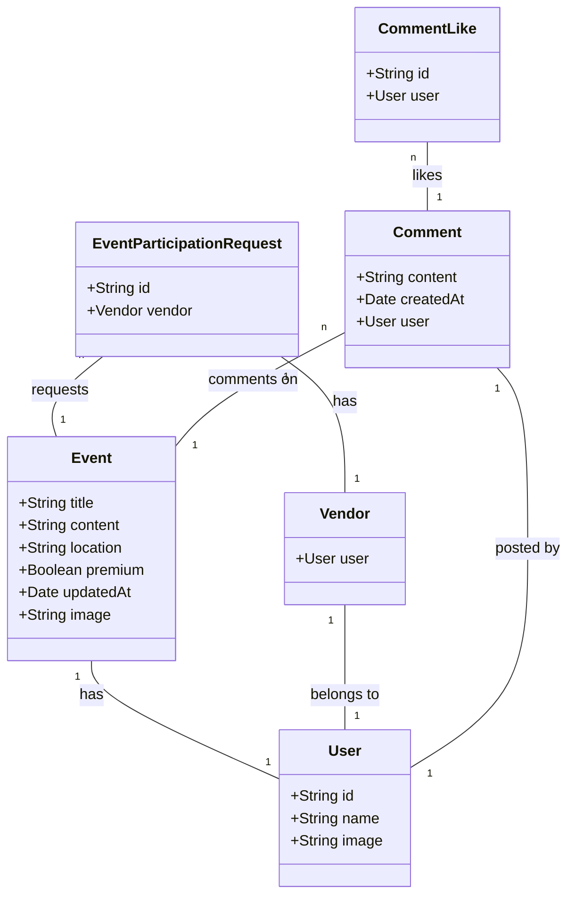

```mermaid
classDiagram
    class Event {
        +String title
        +String content
        +String location
        +Boolean premium
        +Date updatedAt
        +String image
    }
    class User {
        +String id
        +String name
        +String image
    }
    class EventParticipationRequest {
        +String id
        +Vendor vendor
    }
    class Vendor {
        +User user
    }
    class Comment {
        +String content
        +Date createdAt
        +User user
    }
    class CommentLike {
        +String id
        +User user
    }

    Event "1" -- "1" User : has
    EventParticipationRequest "n" -- "1" Event : requests
    EventParticipationRequest "1" -- "1" Vendor : has
    Vendor "1" -- "1" User : belongs to
    Comment "n" -- "1" Event : comments on
    Comment "1" -- "1" User : posted by
    CommentLike "n" -- "1" Comment : likes
```