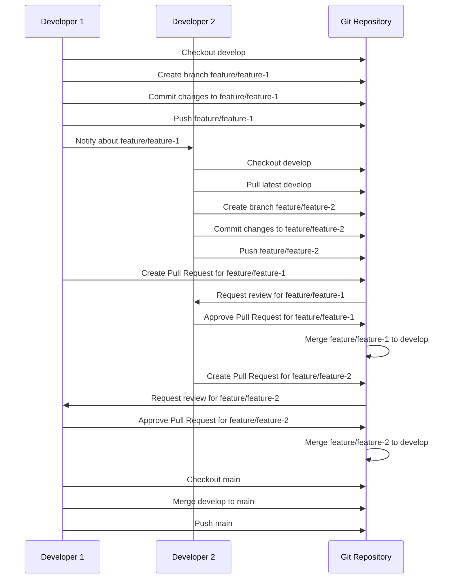

```mermaid
sequenceDiagram
    participant Developer1 as Developer 1
    participant Developer2 as Developer 2
    participant GitRepo as Git Repository
    
    Developer1->>GitRepo: Checkout develop
    Developer1->>GitRepo: Create branch feature/feature-1
    Developer1->>GitRepo: Commit changes to feature/feature-1
    Developer1->>GitRepo: Push feature/feature-1
    Developer1->>Developer2: Notify about feature/feature-1

    Developer2->>GitRepo: Checkout develop
    Developer2->>GitRepo: Pull latest develop
    Developer2->>GitRepo: Create branch feature/feature-2
    Developer2->>GitRepo: Commit changes to feature/feature-2
    Developer2->>GitRepo: Push feature/feature-2

    Developer1->>GitRepo: Create Pull Request for feature/feature-1
    GitRepo->>Developer2: Request review for feature/feature-1
    Developer2->>GitRepo: Approve Pull Request for feature/feature-1
    GitRepo->>GitRepo: Merge feature/feature-1 to develop

    Developer2->>GitRepo: Create Pull Request for feature/feature-2
    GitRepo->>Developer1: Request review for feature/feature-2
    Developer1->>GitRepo: Approve Pull Request for feature/feature-2
    GitRepo->>GitRepo: Merge feature/feature-2 to develop
    
    Developer1->>GitRepo: Checkout main
    Developer1->>GitRepo: Merge develop to main
    Developer1->>GitRepo: Push main
```