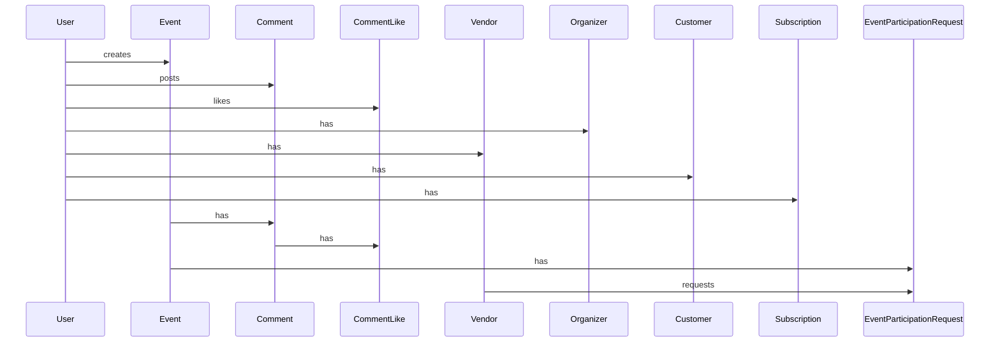

```mermaid
sequenceDiagram
    participant U as User
    participant E as Event
    participant C as Comment
    participant CL as CommentLike
    participant V as Vendor
    participant O as Organizer
    participant Cu as Customer
    participant S as Subscription
    participant ERP as EventParticipationRequest

    U->>E: creates
    U->>C: posts
    U->>CL: likes
    U->>O: has
    U->>V: has
    U->>Cu: has
    U->>S: has
    E->>C: has
    C->>CL: has
    E->>ERP: has
    V->>ERP: requests
```
